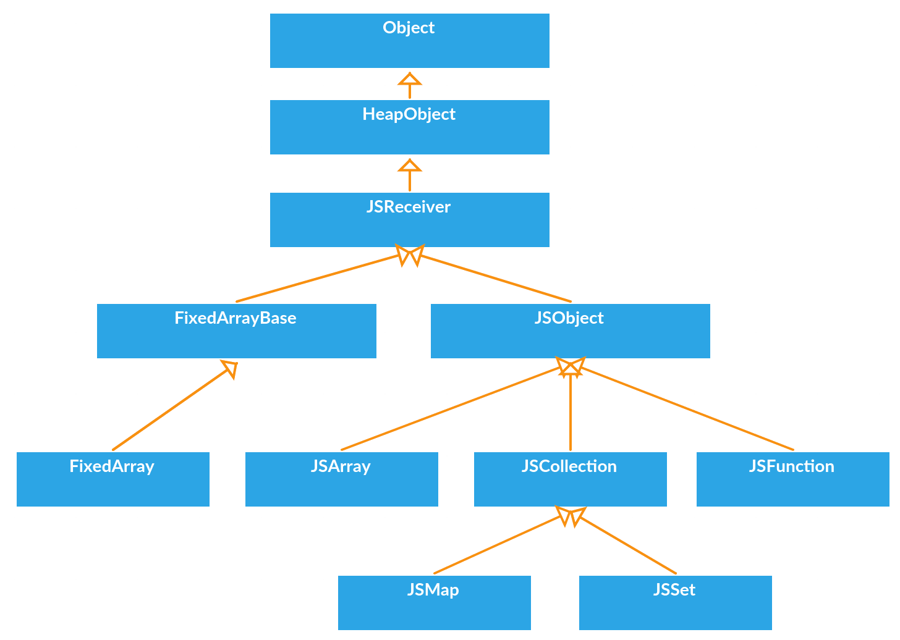
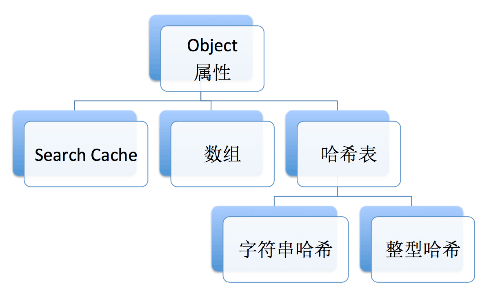

# 从V8源码看 JSObject的实现 #
V8里面所有的数据类型的根父类都是Object，Object派生HeapObject，提供存储基本功能，往下的JSReceiver用于原型查找，再往下的JSObject就是JS里面的Object，Array/Function/Date等继承于JSObject。左边的FixedArray是实际存储数据的地方。


## 创建JSObject ##
在创建JSObject之前，会先把读到的Object的文本属性序列化成constant_properties，如下的data：
```
var data = {
  name: "yin",
  age: 18,
  "-school-": "high school"
};
```
会被序列成一个FixedArray：
```
../../v8/src/runtime/http://runtime-literals.cc 72 constant_properties:
0xdf9ed2aed19: [FixedArray]
– length: 6
[0]: 0x1b5ec69833d1 <String[4]: name>
[1]: 0xdf9ed2aec51 <String[3]: yin>
[2]: 0xdf9ed2aec71 <String[3]: age>
[3]: 18
[4]: 0xdf9ed2aec91 <String[8]: -school->
[5]: 0xdf9ed2aecb1 <String[11]: high school>
```
FixedArray是V8实现的一个类似于数组的类，它表示一段连续的内存，上面的FixedArray的length = 6，那么它占的内存大小将是： ``length * kPointerSize``

因为它存的都是对象的指针（或者直接是整型数据类型，如上面的18），在64位的操作系统上，一个指针为8个字节，它的大小将是48个字节。它记录了一个初始的内存开始地址，使用元素index乘以指针大小作为偏移，加上开始地址，就可以取到相应index的元素，这和数组是一样的道理。只是V8自己封装了一个，方便添加一些自定义的函数。

FixedArray主要用于表示数据的存储位置，在它上面还有一个Map，这个Map用于表示数据的结构。用来操作FixedArray表示的这段内存。V8根据constant_properties的length，去开辟相应大小空间的Map：
```
Handle<Map> map = ComputeObjectLiteralMap(context, constant_properties,
                                          &is_result_from_cache);
```

把这个申请后的Map打印出来：
```
../../v8/src/heap/http://heap.cc 3472 map is
0x21528af9cb39: [Map]
– type: JS_OBJECT_TYPE
– instance size: 48
– inobject properties: 3
– back pointer: 0x3e2ca8902311 <undefined>
– instance descriptors (own) #0: 0x3e2ca8902231 <FixedArray[0]> // 新建时内容为空
```

有一个叫做descriptors表示它的数据结构。descriptor记录了每个key-value对，以及它们在FixedArray里面的index. 后续对properties的操作基本上通过descriptor进行。

有了这个map的对象之后，用它来创建一个JSObect：
```
Handle<JSObject> boilerplate =
    isolate->factory()->NewJSObjectFromMap(map, pretenure_flag);
```
重新开辟一段内存，把map的内容拷过去。由于map只是一段相应大小的内存空间，它的内容是空的，所以接下来要设置它的properties：
```
for (int index = 0; index < length; index += 2) {
  Handle<Object> key(constant_properties->get(index + 0));
  Handle<Object> value(constant_properties->get(index + 1));
  Handle<String> name = Handle<String>::cast(key);
  JSObject::SetOwnPropertyIgnoreAttributes(boilerplate, name,
                                           value, NONE);
}
```
通过上面的代码，把properties设置到map的FixedArray里面，并且可以通过index用descriptors迅速地取出key-value。

**在设置properties的同时，会初始化一个searchCache，这个cache支持哈希查找某个属性。**

## 字符串哈希查找 ##
在设置cache的时候，会先进行查找是否已存在相同的属性名，如果已经有了就把它的value值覆盖掉，否则把它添加到cache里面：
```
int DescriptorArray::SearchWithCache(Isolate* isolate, Name* name, Map* map) {
  DescriptorLookupCache* cache = isolate->descriptor_lookup_cache();
  //找到它的index
  int number = cache->Lookup(map, name);
  //如果没有的话
  if (number == DescriptorLookupCache::kAbsent) {
    //通过遍历找到它的index
    number = Search(name, number_of_own_descriptors);
    //更新cache
    cache->Update(map, name, number);
  }
  return number;
}
```
如上代码的注释，我们先来看一下这个Search函数是怎么进行的：

```
template <SearchMode search_mode, typename T>
int Search(T* array, Name* name, int valid_entries, int* out_insertion_index) {
  // Fast case: do linear search for small arrays.
  const int kMaxElementsForLinearSearch = 8;
  if (valid_entries <= kMaxElementsForLinearSearch) {
    return LinearSearch<search_mode>(array, name, valid_entries,
                                     out_insertion_index);
  }
 
  // Slow case: perform binary search.
  return BinarySearch<search_mode>(array, name, valid_entries,
                                   out_insertion_index);
}
```
如果属性少于等于8个时，则直接线性查找即依次遍历，否则进行二分查找，在线性查找里面判断是否相等，是用的内存地址比较：
```
// linearSearch
for (int number = 0; number < valid_entries; number++) {
  if (array->GetKey(number) == name) return number;
}
```

https://zhuanlan.zhihu.com/p/26169639

## ES6 Map 的实现 ##
V8的Map的核心逻辑是用JS实现的，具体文件是在v8/src/js/collection.js。以下为Map中set函数的实现：
```
function MapSet(key, value) {
  //添加一个log
  %LOG("MapSet", key);
  var table = %_JSCollectionGetTable(this);
  var numBuckets = ORDERED_HASH_TABLE_BUCKET_COUNT(table);
  var hash = GetHash(key);
  var entry = MapFindEntry(table, numBuckets, key, hash);
  if (entry !== NOT_FOUND) return ...//return代码省略
  //如果个数大于capacity的二分之一，则执行%MapGrow(this)代码略
  FIXED_ARRAY_SET(table, index, key);
  FIXED_ARRAY_SET(table, index + 1, value);
}
```

这些JS代码最后会被组装成native code。在V8里，除了Map/Set之外，很多ES6新加的功能，都是用的JS实现的，如数组新加的很多函数。

## Object和ES6 Map的速度比较 ##
总体而言，当查找的keys找不到时，object更加地消耗时间（在实际的使用中，一半找得到一半找不到的情况应该会比较多一点）。这很可能是因为object里面每个key需要实例化一个全局唯一的name，如果name已经存在了，那么它已经实例化好了，包括它的哈希值计算已经缓存起来了，如果未知的name越多，那么需要实例化的name也就越多，而map不存在这种情况，每次都是重新计算哈希。另一方面还可能和它们的哈希算法有关。

Object存储和查找一个属性时，可通过以下方式：


属性不超过128个，使用Search Cache，当属性是较为连续的数字时，使用数组，此种方式最快。其它情况使用哈希表，并且数字和字符串的哈希不一样。

可以把Object当成哈希map使用，但是在效率上可能会比不上ES6的Map，并且还有Object原型查找的问题。
