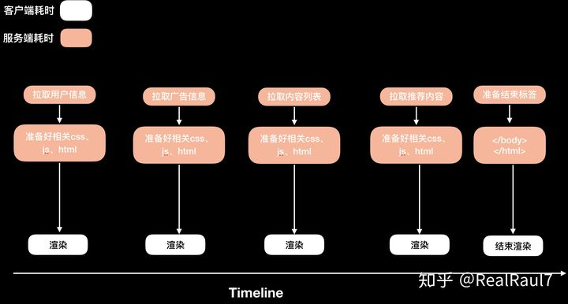
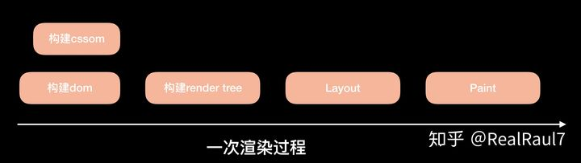
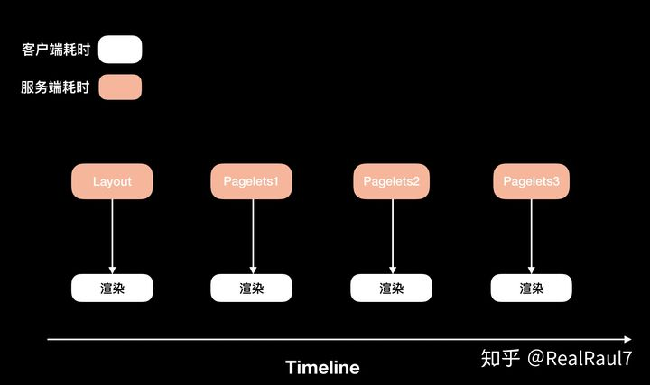
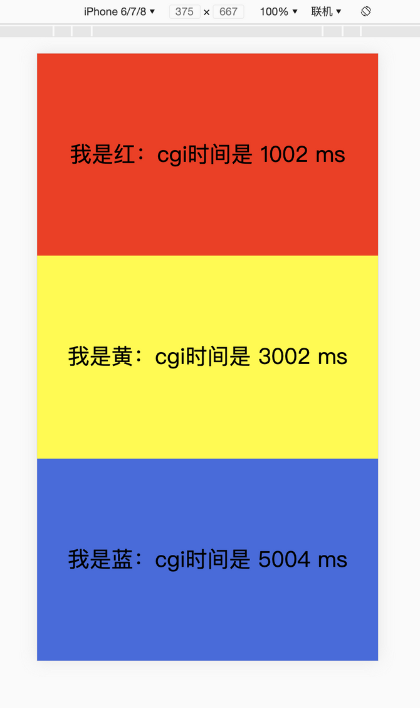
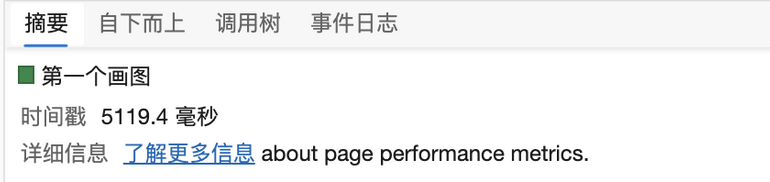
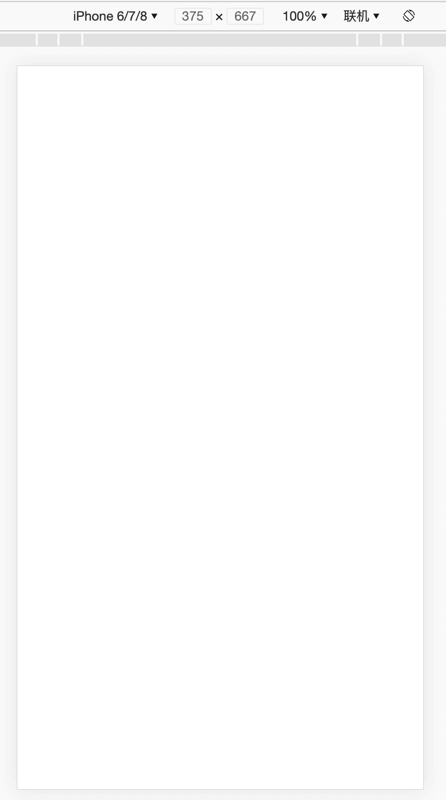
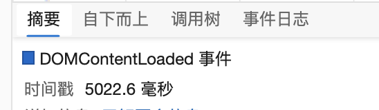

# bigPipe （SSR的解决方案）#
bigPipe是由facebook提出来的一种动态网页加载技术。它将网页分解成称为pagelets的小块，然后分块传输到浏览器端，进行渲染。它可以有效地提升首屏渲染时间。

## 网页首屏加载方案 ##
首屏加载方案指的是在服务端就已经吐出页面的方案，也就是说有SSR的方案，那些纯客户端渲染的方案不做比较，因为它们没有首屏要求。
现有的网页首屏加载方案一般会经过以下阶段:

1. 发送http请求到服务端
2. 服务端接收并分析请求
3. 服务端根据请求从存储层获取相关数据，这里可能会比较耗时，比如如果首页涉及多个模块（广告位、推荐、内容列表、用户信息、好友列表等）
4. 服务端准备好所有内容，拼接成完整的html文档
5. 发送回客户端
6. 客户端接收完整的html文档
7. 构建dom、cssom, 生成render tree，渲染出指定页面

第3步并行拉取业务数据在某些场景下（模块多，业务场景复杂），是会占用比较多的时间的。而且只要其中某个模块的数据如果拉取较慢，会拖慢整个首屏的显示。更糟糕的情况下，某些模块数据相互依赖，导致需要串行拉取数据，那造成的浏览器的等待则会更久。

## 优化方案 ##
而bigPipe就是针对第3、4步进行优化，让服务端在准备好某个模块的数据后，立马返回给客户端显示，而不必要等待完整的数据和html生成，再发送给客户端。

客户端在接收到某一部分内容后，就可以开始渲染，显示执行（这里可以动态请求需要的css，js 等等）。如下图，客户端拉取业务数据和客户端渲染页面可以并行。如果某一部分比如广告信息拉取超时，也并不影响其他部分率先渲染显示。



## bigPipe 原理 ##

## 1. 分段传输 ##
bigPipe依赖于分段传输html页面，所以这是实现bigPipe的一个基础。  【传输，browser怎么合成多个html？？】

## http1.1 ##

如果在http1.1版本上实现，那需要设置Transfer-Encoding为chunked,也就是分块传输编码。

关于分块传输编码：

分块传输编码允许服务器为动态生成的内容维护HTTP持久连接。在这种情况下，不能使用HTTP Content-Length头来分隔内容和下一个HTTP请求/响应，因为内容大小未知。

分块编码的好处是，在返回客户端前不必生成完整的内容，因为它允许将内容作为分块进行流式处理，并明确地发出内容结尾的信号，从而使连接可用于下一个HTTP请求/响应。每个分块包含十六进制的长度值和数据，长度值独占一行，长度不包括它结尾的 CRLF(\r\n)，也不包括分块数据结尾的 CRLF。

最后一个分块长度值必须为 0，对应的分块数据没有内容，表示实体结束。

## http 2 ##
如果你使用的是http2，那则无需设置Transfer-Encoding为chunked，因为http2本身就是支持这种分块传输的协议。

## 浏览器渲染原理 ##


**浏览器并不会等解析完完整的html文档后，才进行layout 和paint。**所谓的一次渲染过程，在分块传输的时候，是可以多次进行的。直到接收到</body></html>闭合标签。

将页面分成各个模块，称之为一个个pagelets，每个pagelets包含自己需要的模板数据，css样式和需要的js。

在传输pagelets之前，**先将页面主体layout传输到客户端，先进行渲染**，此时，用户已经可以看到页面的主体框架了。**减少白屏时间，但页面会多次重绘。**



一开始返回的layout html如下：

```
<html>
	<head>
		<script>
			window.BigPipe = {};
			// ... do something
			BigPipe.handlePagelet = (pagelet) => {
				const conainer = document.querySelector(pagelet.selector)
				downloadAllCSS(pagelet.css)
					.then(() => {
						conainer.innerHTML = pagelet.content;
						// ... do things
					});
			}
		<script>
	</head>

	<body>
		<div id="profile"></div>
		<div id="friends"></div>
		<div id="messages"></div>
		<div id="feeds"></div>
		...others
```

在返回 HTML 片段后，服务器会根据刚才所说的步骤去生产 pagelet，并行的去拉取每个 pagelet 的数据，一旦某个 pagelet 的数据拉取完成，马上生成对应的 HTML 标记返回给浏览器，然后浏览器接管相关操作，比如当某个 pagelet 数据拉取完后，会生成如下数据返回给前端，这里用了 express 作为例子

```
app.use(async (req, res) => {

	await Promise.all([
		getProfilePageletData(req)
			.then(data => {
				const htmlFragement = makeHtml(data);
				res.write(`
					<script>
						BigPipe.handlePagelet({
							selector: 'profile',
							content: htmlFragement,
							js: [...data.js],
							css: [...data.css],
						})
					</script>
				`)
			}),
			// ... 其他 pagelet 操作
	])

	res.end();
});
```

在浏览器端，通过 handlePagelet 函数接收到相应的 pagelet 后，首先会去下载相应的 CSS 文件，等到 CSS 样式文件下载完成后，通过 selector 属性，我们将 pagelet 的 html 内容设置到正确的 div 标签下。并且多个 pagelte 的 CSS 文件的下载可以是并行的，我们简单的遵循着谁先完成，谁先展示的策略。对于 JS 文件，BigPipe 会等到所有的 pagelet 被展示后，才会开始下载，执行顺序同样遵循着简单的谁先完成，谁先执行的策略。

## 演示 ##
koa2 实现的一个传统交付模型，目录结构如下：

```
// project
├── package.json
├── src 
|  ├── big-pipe
|  |  └── index.js // big-pipe 架构的实现
|  └── legacy
|     └── index.js // 经典架构的实现
└── static
   ├── big-pipe // big-pipe 架构下的 css 文件
   |  ├── blue.css
   |  ├── red.css
   |  └── yellow.css
   └── legecy // 经典架构下的 css 文件
      └── index.css
```

```
// /src/legacy/index.js

const Koa = require('koa');
const static = require("koa-static");
const path = require('path')

const app = new Koa();
console.log(__dirname);
app.use(static(path.resolve(__dirname, '../../static')));

const asyncWait = (time = 1000) => new Promise(resolve => setTimeout(resolve, time));

const getRedData = async () => {
    const time = 1000;
    const date = Date.now();
    await asyncWait(time);
    return Date.now() - date;
}

const getYellowData = async () => {
    const time = 3000;
    const date = Date.now();
    await asyncWait(time);
    return Date.now() - date;
}

const getBlueData = async () => {
    const time = 5000;
    const date = Date.now();
    await asyncWait(time);
    return Date.now() - date;
}

const makeHTML = (data) => `
<!DOCTYPE html>
<html>
<head>
    <meta charset="UTF-8">
    <meta name="viewport" content="width=device-width, initial-scale=1.0">
    <title>legacy</title>
    <link rel="stylesheet" href="/legecy/index.css">
</head>
<body>
    <div class="red">
        我是红：cgi时间是 ${data.red} ms
    </div>
    <div class="yellow">
        我是黄：cgi时间是 ${data.yellow} ms
    </div>
    <div class="blue">
        我是蓝：cgi时间是 ${data.blue} ms
    </div>
</body>
</html>
`;

app.use(async (ctx, next) => {
    const datas = await Promise.all([
        getRedData(),
        getYellowData(),
        getBlueData(),
    ]);

    const data = {
        red: datas[0],
        yellow: datas[1],
        blue: datas[2],
    };

    const html = makeHTML(data);

    ctx.body = html;
});

const server = app.listen(3030, '127.0.0.1', () => {
    console.log(`server start in http://127.0.0.1:${3030}`);
});
```
最终我们看到的画面:



接下来，我们来用 chrome 性能分析工具看下首屏时间



## BigPipe 架构 ##
在 BigPipe 架构下，我们需要将整个页面拆分成 pagelets ，这里我们正好对应着红黄蓝三个色块拆封成 3 个 pagelet ，同样的我们需要对应 css 文件也进行拆分.

```
const Koa = require('koa');
const static = require("koa-static");
const path = require('path')

const app = new Koa();
console.log(__dirname);
app.use(static(path.resolve(__dirname, '../../static')));

const asyncWait = (time = 1000) => new Promise(resove => setTimeout(resove, time));

const getRedData = async () => {
    const time = 1000;
    const date = Date.now();
    await asyncWait(time);
    return Date.now() - date;
}

const getYellowData = async () => {
    const time = 3000;
    const date = Date.now();
    await asyncWait(time);
    return Date.now() - date;
}

const getBlueData = async () => {
    const time = 5000;
    const date = Date.now();
    await asyncWait(time);
    return Date.now() - date;
}

const startHTML = `
<!DOCTYPE html>
<html>
<head>
    <meta charset="UTF-8">
    <meta name="viewport" content="width=device-width, initial-scale=1.0">
    <title>big-pipe</title>
    <style>
            * {
            margin: 0;
        }
    </style>
    <script>
        const BigPipe = window.BigPipe = {};

        // css 直接用link tag挂在HTML头部
        BigPipe.downloadCSS = href => new Promise((resolve, reject) => {
            var node = document.createElement('link');
            node.onload = resolve;
            node.onerror = reject;
            node.type = 'text/css';
            node.rel = 'stylesheet';
            node.href = href;
            var head = document.getElementsByTagName('head')[0];
            head.appendChild(node);
            console.log(head);
        });
        BigPipe.handlePagelet = async pagelet => {
            const container = document.querySelector(pagelet.selector);
            if (container) {
                await Promise.all(pagelet.css.map(href => BigPipe.downloadCSS(href)));
                container.innerHTML = pagelet.content;
            }
        };
    </script>
</head>
<body>
    <div class="red"></div>
    <div class="yellow"></div>
    <div class="blue"></div>
`;

const generateMakeup = (selector, content, css = [], js = []) => {
    const pagelet = {
        selector,
        content,
        css,
        js,
    };
    return `
    <script>
        BigPipe.handlePagelet(${JSON.stringify(pagelet)});
    </script>
    `;

}

app.use(async (ctx, next) => {
    ctx.res.statusCode = 200;
    ctx.res.write(startHTML);
    await Promise.all([
        getRedData()
            .then(time => {
                const html = `我是红：cgi时间是 ${time} ms`;
                ctx.res.write(generateMakeup(
                    '.red',
                    html,
                    ['/big-pipe/red.css'],
                    ));
            }),
        getYellowData()
            .then(time => {
                const html = `我是黄：cgi时间是 ${time} ms`;
                ctx.res.write(generateMakeup(
                    '.yellow',
                    html,
                    ['/big-pipe/yellow.css'],
                    ));
            }),
        getBlueData()
            .then(time => {
                const html = `我是蓝：cgi时间是 ${time} ms`;
                ctx.res.write(generateMakeup(
                    '.blue',
                    html,
                    ['/big-pipe/blue.css'],
                    ));
            }),
    ]);

    ctx.res.end(`
        </body>
    </html>
    `);
});

const server = app.listen(3031, '127.0.0.1', () => {
    console.log(`server start in http://127.0.0.1:${3031}`);
});
```

网页加载的效果如下：





可以看到 DOMContentLoaded 事件发生的时间，也就是我们完全渲染出画面的时间，这里的时间和传统渲染模型下的首屏时间差不多。也就说，尽管我们最终显示出画面的时间可能是差不多一样的，但是 BigPipe 架构下，我们首屏的时间会非常快！

