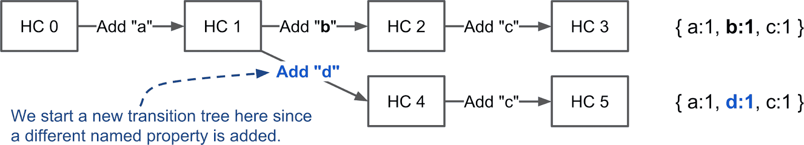

# Named properties vs. elements
原文： **https://v8.dev/blog/fast-properties**

JSObject将命名属性和Array-index属性（数组）分别保存在Properties和Elements中。
初始化是都是数组，当数组是稀疏数组时会转换为字典。Array-index属性可以通过key快速找到数据在elements中的偏移位置。但命名属性需要hiddenClass保存key和数据在properties数组中偏移位置的映射。


**总结：**
1. Array index属性存在elements。
2. 命名属性存在properties。
3. elements和properties 都可以是数组或者字典。
4. 每个js object都有一个hiddenClass与之关联，用于保存object的结构（key和偏移位置的映射）。
5. 命名属性和integer-indexed属性区别主要是遍历。


# HiddenClass 和 DescriptionArrays
HiddenClass主要保存object的元数据，包括属性的数量和对象原型（prototype）的引用。HiddenClass近似于面向对象里的类。然而，js是动态语言，不会预知类的结构，所以HiddenClass是动态创建和更新的。HiddenClass是对象结构的标识符，也是V8优化编译器和内联缓存的重要部分。例如，优化编译器可以直接访问内联属性，如果他可以通过HiddenClass确认对象是兼容的。


bit field 3 保存了属性的数量和一个指向descriptor Array的指针。
descriptor array保存了命名属性的数量，和key对应的偏移位置detail。（descriptor array里不涉及跟integer indexed属性相关的信息）。

具有相同结构的object（相同顺序的相同命名属性）共享相同的HiddenClass。

例子：


每次增加属性时，HiddenClass也会改变，从而形成一颗转移树transition tree。（如下图，改变integer-index属性不会改变HiddenClass。）




**总结：**
1. 有相同结构的Objects共享一个HiddenClass
2. 每新添加一个命名属性都会新建一个HiddenClass。
3. **添加 integer-indexed属性 不会创建新的HiddenClass。**

# 三种不同的命名属性：
V8会尽量避免以字典形式存储属性，因为字典会阻碍某些优化，像inline caches。

## in-object vs. 快属性 ##
in-object属性是直接存储在object结构内的（直接存值，非引用）。**是最快的访问方式**。
默认in-object属性为10。超出数量的属性保存在properties或elements中。


## 快，慢属性 ##
快属性是存在线性的数组中，从HiddenClass的描述数组descriptor array中获取key对应的index，根据index获取properties数组中的值。
如果object有大量的添加和删除操作，会耗费时间和内存去维护descriptor array和HiddenClass，此时快属性会变为慢属性。
慢属性用字典作为存储方式，属性的元数据不再存在descriptor array里，而直接存在属性字典。此时添加删除属性不会改变HiddenClass。但由于inline cache在字典中不生效，所以慢属性比有inline cache的快属性慢。


**总结：**
1. 命名属性的3种保存方式：in-object，快（array+HiddenClass），慢（字典）
2. in-object属性直接存在object结构内，访问速度最快。快属性存在properties数组内，元数据存在HiddenClass的descriptor array中。慢属性保存在properties字典中，key，值和元数据都保存在字典中。
3. 慢属性能快速的添加和删除，但访问速度比其余2种方式慢。

## Elements 和 array-indexed属性 ##
虽然数字索引的属性都保存在elements中，但存在20种类型的elements。
### Packed or Holey Elements：（紧凑和稀疏elements） ###
如果删除一个非末尾位置的元素，则会造成空洞，如 `[1, ,3]`。例子：
```
const o = ['a', 'b', 'c'];
console.log(o[1]);          // Prints 'b'.`

delete o[1];                // Introduces a hole in the elements store.
console.log(o[1]);          // Prints 'undefined'; property 1 does not exist.
o.__proto__ = {1: 'B'};     // Define property 1 on the prototype.

console.log(o[0]);          // Prints 'a'.
console.log(o[1]);          // Prints 'B'.
console.log(o[2]);          // Prints 'c'.
console.log(o[3]);          // Prints undefined
```


**当数组中元素删除后，最好是用一个特殊值_hole代替原位置，保证elements数组是紧凑的，避免查找某值的时候往原型链上找。（耗时）**
### fast or dictionary elements 快元素和字典元素 ###
fast elements 用C++内的数组结构进行保存，用index作为key。对于稀疏数组是空间上的浪费，此时会转为字典存储。
```
const sparseArray = [];
sparseArray[9999] = 'foo'; // Creates an array with dictionary elements.
```
慢元素的字典是key-value-descriptor的3元祖。V8并不会将descriptor存在HiddenClass中，而是直接存在元祖中。**数组方法在慢元素存储方式下会格外慢。**


### Smi and Double Elements:（小整数，浮点数元素） ###
快元素存储中还能分为只存储小整数或浮点数元素。如果数组只保存小整数，**GC并不需要查找回收数组，因为整数直接编码为Small integers(Smis)**，另外浮点数通常表示为一个object，V8会将浮点数数组存为原生的Double数组（即直接存为C++里的Double数组）。
```
const a1 = [1,   2, 3];  // Smi Packed
const a2 = [1,    , 3];  // Smi Holey, a2[1] reads from the prototype
const b1 = [1.1, 2, 3];  // Double Packed
const b2 = [1.1,  , 3];  // Double Holey, b2[1] reads from the prototype
```

### Special Elements 特殊元素 ###
除了上述的7种元素，9种TypedArray元素，2种String Wrappers元素，剩下2种特殊元素，用于保存arguments对象。

具体的elements-kind可见：**https://source.chromium.org/chromium/chromium/src/+/master:v8/src/objects/elements-kind.h**

### ElementsAccessor ###
V8并不会用c++重复实现Array functions 20次，而是创建ElementsAccessor来根据相应的elements kind获取相应的实例（相当于工厂类），并且实现一套简单的方法从存储里获取elements。ElementsAccessor依赖CRTP（template或泛型）来创建不同版本的array functions。例如，你调用slice方法，v8内部调用C++编写的内置函数，并通过ElementsAccessor将其分派到函数的专门版本:


**总结：**
1. 索引属性和命名属性均有快速和字典模式2种存储方式。
2. 快速属性可以是紧凑的，也可以包含指示索引属性已被删除的holes。
3. elements对其内容进行了分类，不同类别不同的处理方法，以此加速Array functions并减少GC开销。
