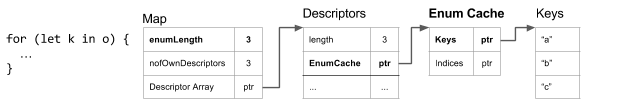
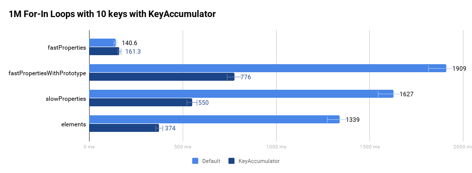

# [v8里如何实现快速 for-in](https://v8.dev/blog/fast-for-in) #

所有浏览器都是按Js规范实现for-in，但规范没有限制指令执行顺序，如下这段代码，不同浏览器可能输出不同结果。

```
const proxy = new Proxy({ a: 1, b: 1},
  {
    getPrototypeOf(target) {
    console.log('getPrototypeOf');
    return null;
    },
    ownKeys(target) {
      console.log('ownKeys');
      return Reflect.ownKeys(target);
    },
    getOwnPropertyDescriptor(target, prop) {
      console.log('getOwnPropertyDescriptor name=' + prop);
      return Reflect.getOwnPropertyDescriptor(target, prop);
    }
  }
);
for(let key in proxy){
  console.log(key);
}
```
如Chrome中输出：
```
ownKeys
getPrototypeOf
getOwnPropertyDescriptor name=a
a
getOwnPropertyDescriptor name=b
b
```
firefox 中输出
```
ownKeys
getOwnPropertyDescriptor name=a
getOwnPropertyDescriptor name=b
getPrototypeOf
a
b
```
为什么会产生这种区别，见JS规范如下：

当调用 EnumerateObjectProperties(Obj) 时
1. 断言 Type(Obj) 是object
2. 返回iterator对象，该对象遍历可枚举对象Obj中的所有string类型的keys。

EnumerateObjectProperties 的实现可参考如下实例：
```
function* EnumerateObjectProperties(obj) {
  const visited = new Set();
  for (const key of Reflect.ownKeys(obj)) {
    if (typeof key === 'symbol') continue;
    const desc = Reflect.getOwnPropertyDescriptor(obj, key);
    if (desc && !visited.has(key)) {
      visited.add(key);
      if (desc.enumerable) yield key;
    }
  }
  const proto = Reflect.getPrototypeOf(obj);
  if (proto === null) return;
  for (const protoKey of EnumerateObjectProperties(proto)) {
    if (!visited.has(protoKey)) yield protoKey;
  }
}
```
从输出可知，V8并没有完全遵循规范示例实现。一开始，例子中for-in的生成器是递归工作的，而V8会预先收集所有keys，主要是出于性能考虑。

## The enum cache ##
一个对象，如`{a: 'value a', b: 'value b', c: 'value c'}`,在V8中有不同的存储方式：in-object，fast，slow。针对fast方式，对象结构都存储在descriptor array中，为了避免筛选不可枚举属性的时间，V8使用EnumCache保存所有可枚举属性键值和位置。


由于慢属性（字典）没有descriptor array，所以V8也不为慢属性提供EnumCache（可枚举属性的cache），integer-indexed属性同理。

**总结：**
1. Maps（HiddenClass）用于保存对象结构。
2. Descriptor Array保存命名属性的元数据（name, configurability, visibility）
3. Descriptor Array可在Maps间共享。
4. 每个Descriptor Array都有一个EnumCache，其中缓存可枚举的命名属性及其引用（指针）

## for-in的机制 ##
V8通过Ignition（字节码解释器）和TurboFan（优化编译器）执行js代码。2者都用相似的方式处理for-in。for-in在C++里实现的伪代码如下：

```
// For-In Prepare:
FixedArray* keys = nullptr;
// 获取HiddenClass
Map* original_map = object->map();
// fast properties
if (original_map->HasEnumCache()) {
  if (object->HasNoElements()) {
    // 直接返回EnumCache中的keys
    keys = original_map->GetCachedEnumKeys();
  } else {
    // EnumCache中的keys 加 Elements的keys
    keys = object->GetCachedEnumKeysWithElements();
  }
} else {
  // in-object或者dictionary，或者尚未建立EnumCache的fast模式
  keys = object->GetEnumKeys();
}

// For-In Body:
for (size_t i = 0; i < keys->length(); i++) {
  // For-In Next:
  String* key = keys[i];
  if (!object->HasProperty(key) continue;
  EVALUATE_FOR_IN_BODY();
}
```
for-in可分解为3步：
1. 收集所有的可枚举的keys（按原型链往上找）
2. 获取next key的指针
3. 执行for-in body

针对fast properties的处理方法如下：（即有descriptor array和EnumCache）
```
FixedArray* JSObject::GetCachedEnumKeysWithElements() {
  FixedArray* keys = object->map()->GetCachedEnumKeys();
  return object->GetElementsAccessor()->PrependElementIndices(object, keys);
}

FixedArray* Map::GetCachedEnumKeys() {
  // Get the enumerable property keys from a possibly shared enum cache
  FixedArray* keys_cache = descriptors()->enum_cache()->keys_cache();
  if (enum_length() == keys_cache->length()) return keys_cache;
  return keys_cache->CopyUpTo(enum_length());
}

FixedArray* FastElementsAccessor::PrependElementIndices(
      JSObject* object, FixedArray* property_keys) {
  Assert(object->HasFastElements());
  FixedArray* elements = object->elements();
  int nof_indices = CountElements(elements);

  FixedArray* result = FixedArray::Allocate(property_keys->length() + nof_indices);
  int insertion_index = 0;
  // 先拷贝elements中的keys
  for (int i = 0; i < elements->length(); i++) {
    if (!HasElement(elements, i)) continue;
    result[insertion_index++] = String::FromInt(i);
  }
  // Insert property keys at the end.
  property_keys->CopyTo(result, nof_indices - 1);
  return result;
}
```
当没有EnumCache的处理如下：
```
FixedArray* JSObject::GetEnumKeys() {
  // Get the receiver’s enum keys.
  FixedArray* keys = this->GetOwnEnumKeys();
  // Walk up the prototype chain.
  for (JSObject* object : GetPrototypeIterator()) {
     // Append non-duplicate keys to the list.
     keys = keys->UnionOfKeys(object->GetOwnEnumKeys());
  }
  return keys;
}

FixedArray* JSObject::GetOwnEnumKeys() {
  FixedArray* keys;
  if (this->HasEnumCache()) {
    keys = this->map()->GetCachedEnumKeys();
  } else {
    keys = this->GetEnumPropertyKeys();
  }
  // 构建EnumCache
  if (this->HasFastProperties()) this->map()->FillEnumCache(keys);
  return object->GetElementsAccessor()->PrependElementIndices(object, keys);
}

// 尚未优化前，UnionOfKeys
FixedArray* FixedArray::UnionOfKeys(FixedArray* other) {
  int length = this->length();
  FixedArray* result = FixedArray::Allocate(length + other->length());
  this->CopyTo(result, 0);
  int insertion_index = length;
  for (int i = 0; i < other->length(); i++) {
    String* key = other->get(i);
    if (other->IndexOf(key) == -1) {
      result->set(insertion_index, key);
      insertion_index++;
    }
  }
  result->Shrink(insertion_index);
  return result;
}
```
以往的实现中，V8存在2个假设：
1. 大对数对象都有fast properties，而且会有EnumCache
2. 只有少量的可枚举属性在原型链中，从原型链中找重复属性的代价是有限的。

然而，如果**对象有slow dictionary属性或者原型链上的许多keys**，UnionOfKeys就会成为一个瓶颈，因为我们每次输入for-in时都必须收集所有可枚举的属性名。

## for-in中的问题 ##
现阶段V8还存在以下错误：
```
var o = {
  __proto__ : {b: 3},
  a: 1
};

//将b设为writable: false, enumerable: false, configurable: false 的属性
Object.defineProperty(o, 'b', {}); 

for (var k in o) console.log(k);

// output:
// a
// b
```
但实际上根据js规范，b不应该输出，因为是不可枚举的。

而且为了适应Proxy等新功能的引入，需要重构收集keys的方法（GetEnumKeys）


## The KeyAccumulator ##
为了处理for-in的keys收集，我们引入KeyAccumulator。新功能如Object.keys和Reflect.ownKeys在收集keys时需要有不同的处理。通过拥有一个可配置的位置，我们可以提高for-in的性能并避免重复代码。
KeyAccumulator分为fast accumulator和slow accumulator，由slow accumulator处理新增的复杂功能，如Proxy。


通过KeyAccumulator 我们进行了性能的改进，避免原始的UnionOfKeys嵌套循环（递归）。并且做了更多的预检查，利用现有的EnumCache避免不必要的重复步骤。为了描述改进，让我们分别关注4类不同的属性的获取。
```
var fastProperties = {
  __proto__ : null,
  'property 1': 1,
  …
  'property 10': n
};

// 有不可枚举属性在prototype上
var fastPropertiesWithPrototype = {
  'property 1': 1,
  …
  'property 10': n
};

var slowProperties = {
  __proto__ : null,
  'dummy': null,
  'property 1': 1,
  …
  'property 10': n
};
delete slowProperties['dummy']

var elements = {
  __proto__: null,
  '1': 1,
  …
  '10': n
}
```



后续补充：
1. UnionOfKeys被怎么改进了？
2. KeyAccumulator怎么实现？
